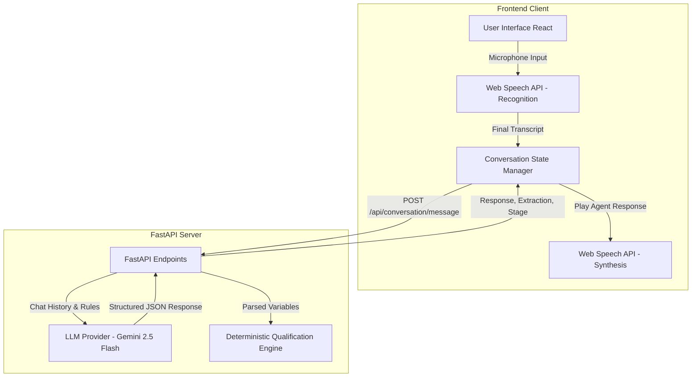

# AI Voice Agent — Whispers of the Wind (WOW)

This project is a professional AI Voice Agent designed for the "Whispers of the Wind (WOW)" real estate project by Divyasree Developers. It acts as an automated, intelligent property consultant that converses with leads, understands their intent, and dynamically qualifies them based on specific criteria.

## 🏗️ Architecture



## 🛠️ Tech Stack

### Frontend
- **Framework:** React 18 with Vite
- **Styling:** Tailwind CSS (Dark Mode Premium UI)
- **Voice APIs:** Native Web Speech API (SpeechRecognition & SpeechSynthesis)
- **Icons:** Lucide React

### Backend
- **Framework:** FastAPI (Python)
- **AI Model:** Google Generative AI (`gemini-3.5-flash-lite`)
- **Data Validation:** Pydantic
- **Environment Management:** `python-dotenv`

## ✨ Features
- **Zero-cost architecture**: Uses native browser Web Speech API for voice interactions and Google Gemini for AI logic, requiring no expensive third-party voice streaming services.
- **Strict State Machine**: Guides users naturally through predefined conversational stages: INTRO -> PERMISSION -> INTENT -> LOCATION -> BUDGET -> TIMELINE -> PITCH -> CTA.
- **Deterministic Qualification**: A rule-based backend engine that evaluates the lead separately from the LLM based on extracted boolean flags.
- **Dynamic Prompting**: The agent's greeting and conversation flow are generated dynamically, preventing stale interactions.
- **Premium UI**: Clean, minimal, real-estate styled dark mode interface with real-time debug visualization.

## 📂 Repository Structure
- `frontend/`: React + Vite client application.
- `backend/`: FastAPI server handling state, LLM interactions, and lead qualification logic.

---

## 🚀 Local Setup

### 1. Backend
1. Navigate to the backend directory:
   ```bash
   cd backend
   ```
2. Create and activate a virtual environment:
   ```bash
   python -m venv venv
   .\venv\Scripts\activate
   ```
3. Install dependencies:
   ```bash
   pip install -r requirements.txt
   ```
4. Create a `.env` file in the `backend` directory and add your Google Gemini API Key:
   ```env
   GEMINI_API_KEY=your_google_gemini_api_key_here
   ```
5. Run the server:
   ```bash
   uvicorn main:app --reload
   ```
   *The backend will run on http://localhost:8000*

### 2. Frontend
1. Navigate to the frontend directory:
   ```bash
   cd frontend
   ```
2. Install dependencies:
   ```bash
   npm install
   ```
3. Create a `.env` file in the `frontend` directory to link the backend:
   ```env
   VITE_API_URL=http://localhost:8000/api
   ```
4. Run the development server:
   ```bash
   npm run dev
   ```
   *The frontend will run on http://localhost:5173*

---

## 🌍 Deployment Instructions

### Deploying the Backend (Render)
1. Push this repository to GitHub.
2. Create a new "Web Service" on [Render](https://render.com/).
3. Set the root directory to `backend`.
4. Set the Build command to: `pip install -r requirements.txt`
5. Set the Start command to: `uvicorn main:app --host 0.0.0.0 --port $PORT`
6. Add the following Environment Variables in Render:
   - `GEMINI_API_KEY`: Your Gemini API Key
   - `ALLOWED_ORIGINS`: Your future frontend URL (e.g., Cloudflare URL)

### Deploying the Frontend (Cloudflare Pages)
1. Create a new project on [Cloudflare Pages](https://pages.cloudflare.com/) and link your GitHub repository.
2. Set the root directory to `frontend`.
3. Select **React** or **Vite** as the framework preset.
4. Build command: `npm run build`
5. Output directory: `dist`
6. Add the following Environment Variable:
   - `VITE_API_URL`: Your live Render backend URL (e.g., `https://your-backend-name.onrender.com/api`)
